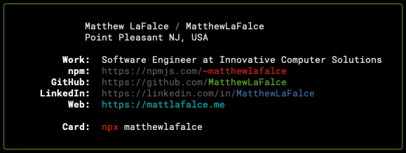

> This package serves as my digital business card

## Usage

```bash
npx matthewlafalce
```

## Development Scripts

```bash
# Build the package
npm run build

# Build and run the package
npm run dev
```

## Inspiration

I was inspired to create this digital business card by Tierney Cyren and [his own card](https://github.com/bnb/bitandbang). It's such a cool idea to run a simple `npx` command and get info about me and where to find my work.
